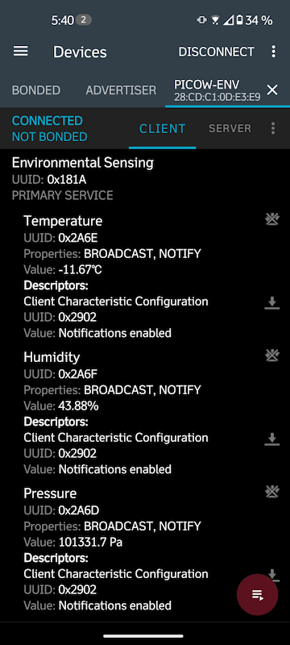

Experiment with Bluetooth Low Energy on Raspberry Pi Pico W broadcasting temperature, humidity and pressure.
Works with "nRF Connect for Mobile" Android application seen in screenshot.

Mostly AI generated code.

